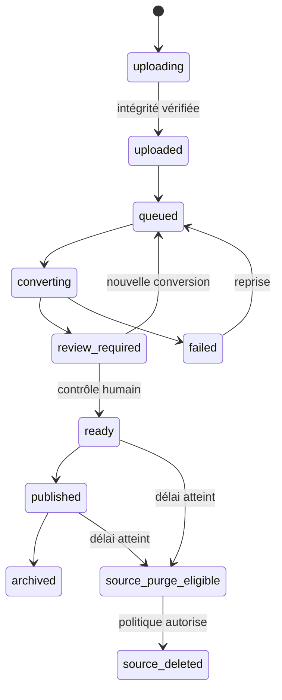

# Cycle de vie des PPTX et dérivés

Statut : **politique cible à valider avant activation du stockage**.

## Décision de principe

Le PPTX source n’est pas nécessaire au lecteur. Il sert à produire une version
web contrôlée et peut être supprimé après validation, mais jamais avant que le
résultat soit vérifié et que la politique de conservation applicable soit connue.

Pour des fichiers typiques de 50 à 100 Mo, Supabase Storage privé est adapté au
pilote. Les métadonnées restent indépendantes du fournisseur afin de permettre
une migration future vers un stockage S3 compatible.

## Catégories

| Catégorie | Exemple | Accès | Conservation proposée |
| --- | --- | --- | --- |
| Source temporaire | `.pptx` déposé | coordinateur propriétaire + worker | 30 jours après validation, puis purge par défaut |
| Source conservée | source marquée « conserver » | coordinateurs autorisés | durée définie par le programme, avec revue annuelle |
| Dérivé publié | images, audio, manifeste, sous-titres | inscrits autorisés via accès temporaire | durée de publication + archivage défini |
| Dérivé de travail | sortie d’une conversion échouée/remplacée | coordinateur + worker | 7 jours après échec ou remplacement |
| Transcription validée | texte/segments utilisés par recherche ou IA | même portée que la ressource | durée de publication et de preuve éditoriale |
| Journaux techniques | statut, erreurs, empreintes | personnel habilité | durée courte définie par la politique de sécurité |

Les durées ci-dessus sont des valeurs de départ, pas une validation juridique.

## Flux d’état

La suppression du source ne change pas le statut du dérivé publié. Elle crée un
événement d’audit contenant l’identifiant, l’empreinte, la taille, la règle de
rétention appliquée et l’acteur ou le processus responsable — jamais le contenu.

## Garde-fous

- bucket `pptx-sources` privé, distinct de `course-artifacts` ;
- chemin immuable par version ; aucun écrasement d’un objet existant ;
- upload reprenable directement vers le stockage après autorisation serveur ;
- empreinte SHA-256 calculée/vérifiée et taille enregistrée ;
- analyse antivirus avant conversion et avant publication ;
- worker seul autorisé à écrire les dérivés techniques ;
- publication seulement après contrôle humain ;
- aucune URL de source retournée au lecteur ;
- suppression asynchrone idempotente et journalisée ;
- option « conserver la source » explicite, jamais implicite ;
- sauvegarde des dérivés et test de restauration avant purge des sources.

## Conséquence d’une suppression du source

Après purge, toute reconversion exige un nouveau dépôt du PPTX. L’interface doit
donc indiquer clairement : « source supprimée, version web conservée » et proposer
un nouveau dépôt créant une nouvelle version, sans remplacer silencieusement la
version publiée.

