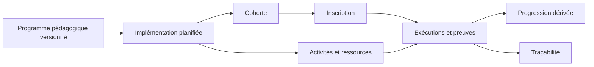
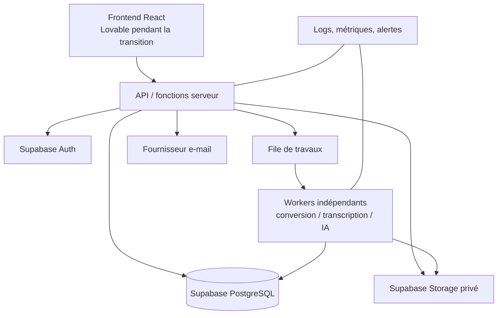

# Campus Santé Augmenté — architecture cible du produit

Statut : **plan directeur de conception**. Ce document ne crée aucune ressource
cloud et ne rend aucune simulation réelle. Les schémas SQL présents dans
`docs/database/draft` restent des brouillons non exécutables sans revue.

## 1. Cap produit

Campus Santé Augmenté est un moteur de formation configurable. Le DIU, le DFASM,
le DPC et les futurs cursus utilisent le même noyau ; leurs différences sont des
configurations et des modules activés, jamais des applications ou des bases
séparées.



Vocabulaire obligatoire :

- le **programme** décrit le contenu pédagogique versionné ;
- l’**implémentation** organise une occurrence réelle du programme : cohorte,
  calendrier, intervenants, modalités et modules activés ;
- l’**inscription** relie une personne à une implémentation/cohorte ;
- une **activité** est ce que l’apprenant doit faire ;
- une **preuve** constate un fait réalisé ou validé ;
- la **progression** est calculée à partir des preuves et ne constitue jamais une
  seconde vérité modifiable.

## 2. Domaines fonctionnels

| Domaine | Responsabilité | Ne doit pas contenir |
| --- | --- | --- |
| Identité | personne, compte, établissement, invitation, consentements | rôle global implicite |
| Autorisation | rôles contextualisés et périmètres plateforme/programme/cohorte/stage | filtrage de sécurité laissé au seul frontend |
| Catalogue pédagogique | programmes et versions, objectifs, modules disponibles | dates d’une session particulière |
| Implémentation | cohorte, calendrier, modalités, intervenants, règles d’achèvement | copie non versionnée du programme |
| Contenus | ressources, versions, assets et cycle éditorial | URL publique durable ou binaire PostgreSQL |
| Activités | consultation, présentiel, visio, QCM, ECOS, stage, audit, dépôt | logique propre à un seul cursus dans le noyau |
| Preuves et progression | événements, tentatives, validations tierces, maîtrise dérivée | pourcentage saisi manuellement |
| Communications | campagnes, audiences, modèles, déclencheurs calendrier | envoi sans approbation ni journal |
| IA | transcription, index validé, assistance et synthèses | accès libre aux données ou clés dans le navigateur |
| Gouvernance | audit, rétention, export, quotas, supervision | suppression silencieuse d’éléments opposables |

## 3. Architecture technique et indépendance



Découpage retenu :

- **GitHub** est la source de vérité du code, des migrations et des décisions ;
- **Lovable** reste un accélérateur d’interface, jamais le propriétaire des
  données ni une dépendance obligatoire du domaine ;
- **Supabase indépendant**, détenu par l’organisation porteuse, fournit au
  départ PostgreSQL, Auth et Storage privé ;
- une **couche serveur** détient toutes les opérations privilégiées, signe les
  accès fichiers et revérifie les autorisations métier ;
- les traitements longs sont exécutés par des **workers indépendants** ; ils ne
  sont ni exécutés dans le navigateur ni couplés au cycle de vie de Lovable ;
- les fournisseurs d’IA et d’e-mail sont derrière des ports remplaçables.

La clé `service_role`, les clés d’IA, les clés SMTP/API et les identifiants des
workers ne sont jamais présents dans le frontend.

## 4. Unité de construction : la tranche verticale

Une capacité n’est réelle que lorsque l’ensemble du flux est raccordé :

1. modèle métier et règles déterministes ;
2. migration et politiques RLS ;
3. opération serveur autorisée et auditée ;
4. interface raccordée sans fallback silencieux vers les fixtures ;
5. tests domaine, SQL/RLS, intégration et parcours utilisateur ;
6. exploitation : erreurs, reprise, quotas et sauvegarde.

Le projet ne bascule donc pas toutes ses fixtures d’un seul coup. Chaque tranche
remplace explicitement une simulation, tout en laissant le reste de la maquette
fonctionner.

## 5. Première tranche : DIU et diaporama sonorisé

Le premier flux réel cible un coordinateur DIU et un apprenant DIU :

```text
connexion
→ sélection d’une implémentation DIU
→ dépôt reprenable d’un PPTX privé
→ conversion asynchrone
→ contrôle humain du résultat
→ publication dans une cohorte
→ lecture sécurisée sans accès au PPTX source
→ preuve de consultation
→ progression individuelle et collective dérivée
```

Ce choix valide simultanément l’identité, la portée programme/cohorte, le
stockage, les travaux asynchrones, la publication, le lecteur et les preuves. Il
fournit ainsi une fondation réutilisable pour les PDF/HTML, puis le DFASM.

## 6. Exigences non négociables avant production

- région et engagements contractuels validés par le responsable de traitement ;
- aucune donnée patient dans un support pédagogique ou une preuve, sauf circuit
  futur explicitement conçu et autorisé ;
- RLS testée avec des scénarios inter-programmes et inter-cohortes négatifs ;
- sauvegarde, restauration et export de sortie documentés et testés ;
- journal append-only des actes sensibles ;
- suppression/rétention définie par catégorie de données ;
- accessibilité, responsive et sécurité applicative intégrées aux critères de
  recette ;
- environnement développement, recette et production séparés.

## 7. Documents d’application

- modèle et RLS actuels : `docs/database/draft/architecture.md` ;
- matrice détaillée : `docs/database/draft/rls_matrix.md` ;
- fichiers privés : `docs/database/draft/storage_architecture.md` ;
- conversion PPTX : `docs/database/draft/narrated_pptx_conversion.md` ;
- écarts maquette/backend : `docs/architecture/backend_gap_analysis.md` ;
- trajectoire d’exécution : `docs/architecture/delivery_roadmap.md` ;
- décisions : `docs/database/draft/decision_log.md`.
