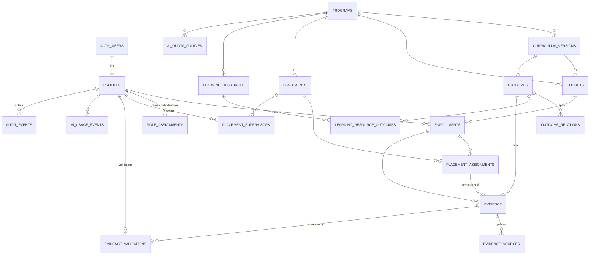

# Architecture de données — Lot 1 (conception non exécutée)

Statut : **DRAFT — DO NOT EXECUTE**. Aucune base activée, aucune migration créée,
aucun appel Supabase. Ce dossier existe pour être relu et validé avant provisioning.

## 1. Diagramme ER (compact)



## 2. Choix de normalisation

- **3NF assumée** ; aucune table de progression. Le niveau de maîtrise est **dérivé**
  de `evidence` + `evidence_validations` par la logique de `src/domain/mastery.ts`.
  Toute matérialisation future sera un cache explicitement marqué (vue matérialisée
  reconstructible), jamais une vérité indépendante.
- **`program_id` dupliqué volontairement** sur `cohorts`, `outcomes`, `enrollments`,
  `placement_assignments`, `evidence`, `learning_resource_outcomes` — mais **jamais
  librement** : chaque duplication est verrouillée par une **FK composite** vers une clé
  alternative `(id, program_id)` du parent. Le programme ne peut donc pas diverger d'une
  ligne à l'autre, et les policies RLS restent des tests locaux (pas de jointures profondes).
- **Rôles hors `profiles`** : `role_assignments` est la seule source de droits
  (prévention d'escalade de privilèges). Cohérence `role`/`scope_kind` en `CHECK`,
  miroir de `isRoleScopeConsistent` côté TypeScript.
- **Encadrement de stage explicite** : `placement_supervisors` est la source de vérité
  de l'autorisation superviseur ; `placement_assignments.supervisor_person_id` n'est
  qu'un référent nommé, contraint par FK à être un encadrant déclaré du stage.
- **N-N par table de liaison** (`learning_resource_outcomes`) plutôt que tableau d'ids.
- **JSONB réservé au contexte non structurant** (`evidence.context`, `audit_events.detail`,
  `evidence_sources.payload`). Aucune règle métier ne dépend d'une clé JSONB.
- **Enums PostgreSQL** alignés 1-1 avec les unions TypeScript (voir §7).
- **Multi-programmes** : un seul compte `auth.users` → N `enrollments` sur N programmes,
  unicité `(person_id, cohort_id)` seulement.

## 3. Flux

### 3.1 Inscription
1. Premier login → `profiles` (INSERT self, `id = auth.uid()`).
2. Un administrateur de programme crée l'`enrollment` (`program_id`, `cohort_id`).
   Aucune auto-inscription possible par RLS.
3. Le rôle `learner` est posé par l'administrateur en portée `cohort`.

### 3.2 Saisie d'une preuve
1. L'apprenant crée `evidence` en `draft` (`created_by = auth.uid()`, `self_declared = true`).
2. Pièces éventuelles dans `evidence_sources` (autorisées uniquement tant que `draft`).
3. Passage en `submitted` par l'apprenant. `score_raw/score_max`, `proposed_mastery`,
   `autonomy_level`, `repetition_count`, `confidence_level`, `context` sont **déclaratifs**.
4. Une preuve `kind = 'placement'` exige un `placement_assignment_id` (CHECK).

### 3.3 Validation tierce
1. Un encadrant du stage, un enseignant du programme ou un administrateur de portée
   insère une ligne `evidence_validations` (`validator_person_id = auth.uid()`).
2. `can_validate_evidence()` exclut le titulaire de l'inscription **et** l'auteur de la saisie.
3. Le service serveur, après cette insertion, passe `evidence.status` à `validated`
   ou `rejected`. Aucune policy client ne permet d'écrire `validated`.
4. Le journal est **append-only** : une décision erronée est corrigée par une décision
   ultérieure, jamais par réécriture.

### 3.4 Calcul de progression
Toujours dérivé, en lecture : preuves comptables par nature d'acquis
(`knowledge` : quiz / validation humaine ; `simulated_competence` : simulation /
validation humaine ; `real_competence` : activité réelle ou stage **plus** validation
tierce). Une compétence réelle auto-déclarée sans validateur reste non acquise.

### 3.5 Import legacy
`source_system`, `source_id`, `imported_at`, `import_batch_id` sur toute table importable.
Import par lots idempotents (clé naturelle `(source_system, source_id)`), en recette
d'abord, avec rapport de rejets.

## 4. Provenance et stratégie d'import

| Famille historique | Cible | Règle |
| --- | --- | --- |
| Utilisateurs | `auth.users` + `profiles` | dédoublonnage par email, `source_id` conservé |
| 116 inscriptions / promotions | `cohorts` + `enrollments` | une promotion = une `cohort`; jamais de doublon `(person_id, cohort_id)` |
| 57 compétences | `outcomes` + `outcome_relations` | rattachement `migrated_from` / `aligned_with` au nouveau référentiel, sans écraser celui-ci |
| 6 612 états historiques | `evidence` (+ `evidence_sources.source_kind = 'legacy_state'`) | importés avec leur `kind` d'origine ; **jamais** `status = 'validated'` sans validateur identifiable |
| Contenus | `learning_resources` (+ liaison) | `is_published = false` par défaut, relecture requise |

Règles non négociables :
1. Aucun état historique n'est importé comme **compétence réelle acquise** : sans
   validateur identifiable, la preuve arrive en `submitted` et reste non comptée.
2. Quand un validateur historique est identifiable, une ligne `evidence_validations`
   est créée avec `source_system` legacy et le `decided_at` d'origine.
3. `import_batch_id` permet un ciblage et un retrait exact d'un lot.
4. Aucune lecture croisée en production sur l'existant : export → transformation → import.

## 5. Rollback et ordre des migrations

Ordre futur (une fois le schéma validé) :

```text
0001_enums_and_profiles
0002_programs_curricula_cohorts
0003_enrollments_and_roles
0004_outcomes_and_relations
0005_learning_resources
0006_placements_and_supervisors
0007_evidence_sources_validations
0008_audit_ai_usage_quotas
0009_rls_functions_and_policies
0010_legacy_import_staging (schéma `staging`, jeté après recette)
```

Rollback :
- chaque migration a un `down` écrit **avant** application (drop policy → drop function →
  drop table → drop type, dans l'ordre inverse) ;
- l'import legacy se déroule dans un schéma `staging` séparé, jamais directement dans
  `public` ; le retrait d'un lot se fait par `import_batch_id` ;
- aucune migration destructive sur `evidence` / `evidence_validations` / `audit_events` :
  seules des migrations additives sont admises après mise en service.

## 6. Limites du Lot 1

- Rien n'est exécuté : pas de base, pas de migration, pas de policy active, pas de test SQL joué.
- L'application continue de fonctionner sur les repositories mock en mémoire.
- Le passage `evidence.status → 'validated'` suppose un service serveur qui n'existe pas encore.
- Le stockage de fichiers (`evidence_sources.storage_path`) suppose un bucket privé non créé.
- Les endpoints IA, quotas et comptabilité (`ai_usage_events`) sont modélisés, non implémentés.
- Le moteur ECOS n'est pas modélisé au-delà de `kind = 'simulation'`.

## 7. Cohérence TypeScript ↔ SQL

| TypeScript (`src/domain/types.ts`) | SQL |
| --- | --- |
| `ProgramKind` | `program_kind` |
| `CurriculumVersion.status` | `curriculum_status` |
| `Enrollment.status` | `enrollment_status` |
| `RoleName` | `role_name` |
| `RoleScope.kind` | `role_scope_kind` |
| `OutcomeNature` | `outcome_nature` |
| `MasteryLevel` / `MASTERY_ORDER` | `mastery_level` (ordre identique) |
| `OutcomeRelationKind` | `outcome_relation_kind` |
| `PlacementAssignment.status` | `placement_assignment_status` |
| `EvidenceKind` | `evidence_kind` |
| `EvidenceStatus` | `evidence_status` |
| `EvidenceValidation.decision` | `validation_decision` |
| `LearningResource.format` | `learning_resource_format` |
| `Provenance` | colonnes `source_system` / `source_id` / `imported_at` / `import_batch_id` |
| `Person` | `profiles` (l'email reste dans `auth.users`) |
| `Evidence.metrics` | non repris : remplacé par colonnes typées + `context` JSONB |
